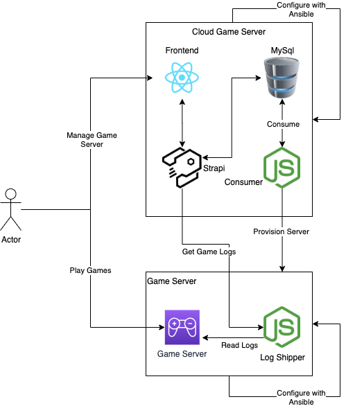

# Cloud Gameserver

Quite often, you are forced to pay for a server that is always available, even though you don't use it all the time. This leads to either high costs or very underpowered hardware.
So, the basic idea of this project is to connect the pay-as-you-go model of cloud infrastructure with dynamic game servers.

The application will provide a web UI where you can manage different games as well as different instances of one game.
If you want to play, you just start the server, wait for some minutes and stop it again when you are done.
This means that you will only pay for the time where you've been actively playing the game, so a desirably low amount of money.

For example: Hetzner CPX51 (16 CPU's & 32G Memory) costs about 9,5ct for one hour of gameplay.

## General Setup


## Components

The application consists of different parts which all have their own task, which I'll describe in the following sections:

### Frontend

The frontend is written in React with Typescript.
It gives the user a visual view of all his configurations and servers.
These include if the server is currently running as well as the server logs and at which port they are reachable.

### Backend

To reduce the complexity and the amount of code, I've decided to use strapi as it provides basic functionality by default.
Strapi has plugins for many different purposes, like User authentication or graphql / rest endpoints.
Furthermore, it's extensible with custom code, which is also used in this project.

In the background, its using a MySQL server to store it's state.
The migrations are also fully managed by strapi, based on diffs between versions.

### Infrastructure

The infrastructure folder includes everything needed to automatically setup the infrastructure.
Right now, only Hetzner cloud is supported.

The infrastructure consists of different tools for different purposes.
Packer is used for prebuilding machine images so that the startup of the instances is faster.
Terraform is used for the automation of infrastructure provisioning. It includes the definition for the admin server as well as the game servers.
The last part is Ansible, which is used for configuration management.

### Async Server Provisioner

This part of the system is basically a queue consumer, which listens for new messages and then starts / stops game servers.
It's written in NodeJS / Typescript and uses a MySQL table as a queuing system.

The exact implementation is described [here](https://github.com/dhenkel92/rds-queuing-system).

#### Provisioner runtime and dependencies

Use Node **24.21.0 (24.x)** and npm 10 or newer. From `async-server-provisioner/`:

```sh
npm ci
npm run build
npm audit
npm start
# Development: TypeScript compilation plus Node's native restart watcher
npm run watch
```

The updated stack uses `config` 5.0.1, Datadog tracing 6.19.0, mysql2 3.24.5, Pino 10.4.0, and ESLint 10.12.0 with flat configuration. YAML 2.9.1 is explicitly installed to parse the existing configuration files. Node's built-in `fetch`, `crypto.randomUUID`, and watch mode replace node-fetch, uuid, and nodemon. Unused React/Airbnb/Jest lint packages and ts-node are removed. TypeScript remains at **6.0.3**, the newest version supported by `@typescript-eslint` 8.71.0 (`<6.1.0`); Node type declarations track Node 24. Compiler configuration retains CommonJS output in `dist/` and the previous non-strict type-checking behavior.

Set `MYSQL_HOST`, `MYSQL_PORT`, `MYSQL_DATABASE`, `MYSQL_USER`, and `MYSQL_PW` for the existing Strapi MySQL database. The consumer requires Strapi's `game_deployments` table; it does not create the schema. Configure `CLOUD_GAME_API_URL`, `CLOUD_GAME_API_TOKEN` (the complete Authorization header value), `HCLOUD_TOKEN`, and `TERRAFORM_PATH` before processing deployments. Additional environment mappings remain in `config/custom-environment-variables.yml`. Use `DD_TRACE_ENABLED=false` for local verification without a Datadog agent. `config/default.yml` supplies defaults for every environment; node-config may warn when no environment-specific file exists.

The backend, frontend, and provisioner now use Strapi 5 together. GraphQL queries and content relations use string `documentId` values and flat records. SQL queue updates still use numeric `game_deployments.id`; the provisioner resolves each game-instance document back to `game_instances.id` so existing Terraform workspace names and metadata remain stable. Do not start the consumer against an unmigrated Strapi 4 database. Compose gates consumer startup on backend health; migration, backup and rollback instructions are in [backend/README.md](backend/README.md).

Both Dockerfiles pin `node:24.21.0-bookworm-slim`, [OpenTofu 1.13.1](https://github.com/opentofu/opentofu/releases/tag/v1.13.1), and [Terragrunt 1.1.6](https://github.com/gruntwork-io/terragrunt/releases/tag/v1.1.6). Tool downloads select amd64 or arm64 binaries and verify upstream SHA256 checksums. Terragrunt calls use its current `run --` CLI; JSON output explicitly forwards OpenTofu stdout. The production image prunes development dependencies.

Terragrunt 1.x requires named include blocks. The shared infrastructure configuration is now `infrastructure/terraform/root.hcl`; all three units include it explicitly. Validate the copied infrastructure tree with `terragrunt hcl validate` before using production credentials.

Build from the repository root:

```sh
docker build -f async-server-provisioner/Dockerfile -t cloud-gameserver-provisioner .
docker build -f async-server-provisioner/Dockerfile-dev -t cloud-gameserver-provisioner-dev async-server-provisioner
```

Production copies the shared `infrastructure/terraform` tree; development retains the project-local Terraform files. Build contexts exclude host dependencies, generated JavaScript, local credentials, Terraform caches, and state while preserving provider lockfiles. The default Terraform directory is `./terraform/02-game-server`.

Verify queue polling against a disposable database or restored copy. A nonempty STARTING/STOPPING queue can provision or destroy real cloud resources; do not use production credentials for smoke checks. Local verification covers SQL reservation/rollback, native-fetch HTTP requests, and provider-free Terragrunt init/workspace/apply/output/destroy operations, not real Hetzner/AWS deployment.

### Game Server Watcher

The game server watcher is a side-car that will be deployed on every game server to export important information via an API.
It's written in Rust, and in the current implementation, it's just checking if the server is reachable by checking if the port is open or not.

Nevertheless, in the future, there are plans to also ship logs and other related information that should be shown in the UI.
