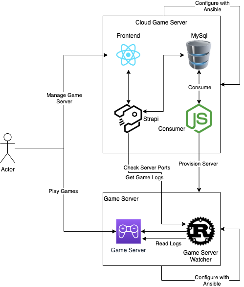

# Cloud Gameserver

<!-- vim-markdown-toc GFM -->

- [General Setup](#general-setup)
- [Components](#components)
  - [Frontend](#frontend)
  - [Backend](#backend)
  - [Infrastructure](#infrastructure)
  - [Async Server Provisioner](#async-server-provisioner)
  - [Game Server Watcher](#game-server-watcher)

<!-- vim-markdown-toc -->

* Dynamically start / stop game servers in the cloud to optimize costs
* Use a MySQL based queing system to provision infrastructure asynchronosly via Terraform
* React UI for users to manage(CRUD) their game servers, update the game settings and view the server logs

## General Setup

## Components

* in the following i'll describe the different components of the tool
* Every part has its own purpose

### Frontend
* written in React
* connects to backend via graphql

### Backend
* Strapi as backend
* fully manaaged backend
* easy to configure & extend
* graphql / rest out of the box
* authentication out of the box

### Infrastructure
* buil dbase images with packer
* ansible for configuration management
* terraform for provisioning resources
* terragrunt as config wrappper over terraform

### Async Server Provisioner
* written in Typescript / NodeJS
* Responsible for provisioning infrastructure
* consumer like application
* uses mysql as message queue

### Game Server Watcher
* written in rust
* watches poort if the GS is ready or not
